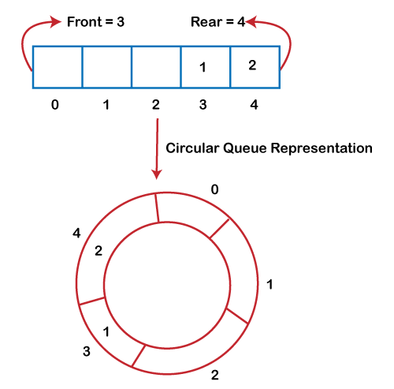

# Table of Contents

- [Table of Contents](#table-of-contents)
- [介绍](#介绍)
- [channel 设计](#channel-设计)
		- [lock](#lock)
		- [buf](#buf)
		- [qcount,dataqsiz](#qcountdataqsiz)
		- [elemsize](#elemsize)
		- [elemtype](#elemtype)
		- [sendx,recvx](#sendxrecvx)
		- [sendq,recvq](#sendqrecvq)
- [使用案例](#使用案例)
	- [介绍](#介绍-1)
	- [发送](#发送)
		- [阻塞](#阻塞)
		- [非阻塞](#非阻塞)
		- [非阻塞并超时控制](#非阻塞并超时控制)
	- [接收](#接收)
		- [阻塞](#阻塞-1)
		- [非阻塞](#非阻塞-1)

---

# 介绍
在正式开始讲解channel之前，首先明白一些channel的知识点

1. 声明和初始化：可以使用内置的`make`函数来创建一个channel。例如，`ch := make(chan int)`会创建一个传递整数类型的channel。

2. 发送和接收操作：使用`<-`操作符进行发送和接收操作。发送操作将数据发送到channel，接收操作从channel接收数据。例如，`ch <- data`将数据发送到channel，`data := <- ch`从channel接收数据。

3. 阻塞和非阻塞：默认情况下，发送和接收操作是阻塞的，意味着在发送或接收数据之前，goroutine会被阻塞。这可以用于实现同步。可以使用`select`语句结合`default`子句来实现非阻塞的发送和接收操作。

4. 单向channel：可以将channel限制为只发送或只接收操作。这可以增加程序的安全性和表达性。例如，`chan<- int`表示只能发送整数的channel，`<-chan int`表示只能接收整数的channel。

5. 关闭channel：可以通过调用`close`函数来关闭一个channel。关闭channel后，接收操作仍然可以接收已经发送的数据，但是不再能发送数据。

# channel 设计
假设我们定义一个缓冲大小为5，类型为 int 的 channel
```
ch := make(chan int,5)
```
`ch`是栈上的一个指针，指向堆上的`hchan`数据结构


### lock
根据CSP模型，channel是用于在不同的并发执行单元（goroutine）之间传递消息的通信机制。
多个 goroutine 可以同时尝试发送或接收数据到/从通道。为了避免竞争条件和数据不一致的问题，要有一把互斥锁用于同步并发访问通道的内部状态。
```golang
lock mutex
```

### buf
对于有缓冲的channel来将，需要一个循环队列(circular queue)用于在channel中存储数据
**循环队列**是一种**环形**数据结构，可以高效地进行数据的入队和出队操作。

通过使用循环队列，buf 字段实现了以下功能：

存储数据：buf 字段指向的数组用于存储通道中的数据元素。当一个 goroutine 发送数据到通道时，数据将被添加到循环队列的末尾；当一个 goroutine 从通道接收数据时，数据将从循环队列的开头被取出。

支持循环操作：由于 buf 字段指向的数组是一个循环队列，因此当队列的末尾达到数组的末尾时，下一个元素将会被放置在数组的开头。这使得循环队列可以循环使用数组空间，而不会浪费内存。



```golang
buf      unsafe.Pointer // points to an array of dataqsiz elements
```

### qcount,dataqsiz
除了存储数据以外，我们还需要知道已经存储了多个元素，以及最多可以存储多少个元素
我们设计 `qcount` 和 `dataqsiz` 字段分别用于记录通道中的数据数量和循环队列的大小

* `qcount`：它表示当前通道中的数据元素数量。每当有一个 goroutine 发送数据到通道或从通道接收数据时，qcount 的值将相应地增加或减少。通过跟踪数据数量，可以在并发操作中确保通道中的数据一致性。

* `dataqsiz`：它表示循环队列的大小，也就是循环队列可以容纳的数据元素数量。该值在创建通道时进行设置。循环队列的大小影响了通道的容量和性能。较大的 dataqsiz 值意味着更多的内存用于存储通道数据，但也提供了更大的容量和更高的吞吐量。

### elemsize
除了容量以外，我们还需要记录每个元素的大小 `elemsize`

* 内存分配：elemsize 字段用于确定为每个元素分配的内存空间大小。当创建通道时，系统会根据 elemsize 的值来分配足够的内存空间来存储每个元素。

* 数据校验：elemsize 字段还用于在通道的发送和接收操作中进行数据校验。在发送数据到通道时，系统会检查要发送的数据的大小是否与 elemsize 字段的值一致，以确保数据的完整性和正确性。同样，在从通道接收数据时，系统也会检查接收到的数据的大小与 elemsize 字段是否匹配，以保证数据的有效性。


### elemtype
保证通道的类型安全和内存管理而设立的。从内存分配的角度来看,编译器和运行时为了确定channel缓冲区的大小和每个元素在缓冲区中的偏移量，设立一个 elemtype 字段表示通道中元素的类型。它是一个指向 `runtime._type` 结构体的指针，用于描述通道中元素的具体类型信息。

* 内存分配：通过 `elemtype` 字段，系统可以在运行时了解通道中元素的类型信息。这对于进行内存分配非常重要，因为系统需要知道每个元素的大小和对齐方式，以便正确地分配和管理内存空间。

* 垃圾回收：`elemtype` 字段还在垃圾回收过程中起着重要的作用。垃圾回收器需要了解通道中元素的类型信息，以便正确地扫描并回收不再使用的对象。通过 `elemtype` 字段，垃圾回收器可以准确地确定通道中存储的对象是否仍然活跃，并相应地回收未使用的内存。

除此以外，`elemtype` 字段还可以帮助编译器和运行时检查发送或接收的值是否与通道的类型匹配，以及在接收时进行类型断言

### sendx,recvx
接下来需要考虑如何在高并发环境下进行读取或写入操作，为保证公平性和高并发情况下，设立 `sendx` 和 `recvx` 字段在 hchan 里面的指示通道缓冲区中的发送和接收索引

* `sendx` 字段：它表示下一个要发送数据的位置（索引）。当一个 goroutine 发送数据到通道时，它将数据放置在 sendx 所指示的位置，并将 sendx 的值递增。这样可以确保每个 goroutine 在通道中发送数据时都能够访问到自己的位置，避免数据的覆盖和冲突。

* `recvx` 字段：它表示下一个要接收数据的位置（索引）。当一个 goroutine 从通道接收数据时，它将从 recx 所指示的位置获取数据，并将 recx 的值递增。这样可以确保每个 goroutine 在通道中接收数据时都能够访问到自己的位置，避免数据的混乱和丢失。

因为 `sendx` 和 `recvx` 都是使用原子操作来更新的，这意味着它们不会被其他的 goroutine 干扰或修改，也不需要加锁来保护它们。
这样就可以提高通道操作的高并发性能，因为不会有锁的开销和竞争。
其次，`sendx` 和 `recvx` 都是按照 FIFO 的顺序来指向缓冲区中的槽位的，这意味着它们会按照发送或接收的顺序来匹配对方。
这样就可以实现通道操作的公平性，因为不会有优先级或随机性的影响。当然，如果通道是无缓冲的，那么 sendx 和 recvx 就没有作用了，因为无缓冲的通道只能同时存储一个元素，所以发送和接收必须同时发生，才能成功

### sendq,recvq
当一个 goroutine 想要对一个通道进行发送或接收操作时，如果通道是空的或满的，或者已经关闭了，那么这个 goroutine 就会被阻塞
我们需要 `recvq` 和 `sendq` 用于存储等待接收和等待发送的 `goroutine` 队列,以便于条件满足的时候唤醒相应的 goroutine
recvq 和 sendq 是存储了一个双向链表`waitq`，该链表每个节点是一个 `sudog` 结构体，它包含了被阻塞的 goroutine 的信息，以及它想要发送或接收的值的地址
下面是 waitq 结构体的定义
```golang
// 双向链表存储头和尾的节点
type waitq struct {
	first *sudog
	last  *sudog
}
```


下面是 `sudog` 结构体的定义
```golang
// sudog 是在等待列表中表示goroutine的对象，用于在channel上发送/接收等操作。
// sudog的存在是因为goroutine与同步对象之间的关系是多对多的。一个g可以在多个等待列表上，所以可能会有多个sudog对应一个goroutine；
// 同时，许多goroutine可能正在等待相同的同步对象，因此可能会有多个sudog对应一个对象。
// sudog是从一个特殊的池中分配的。可以使用acquireSudog和releaseSudog来分配和释放它们
type sudog struct {
    // 指向被阻塞的 g 的指针，它保存了 g 的状态和栈信息
	g *g    

    // 双向链表的指针，它们用于将 sudog 连接到等待队列中的其他 sudog
	next *sudog
	prev *sudog

    // 字段是一个指向数据元素的指针，它可能指向栈上或堆上的内存空间，用于存储想要发送或接收的值。
	elem unsafe.Pointer // data element (may point to stack)

    // 以下字段禁止并发访问。
    // 对于通道，waitlink只由g访问。
    // 对于信号量，所有字段（包括上面的字段）只在持有semaRoot锁时访问。

    // goroutine 获取锁或进入等待状态的时间戳
	acquiretime int64
    // goroutine 释放锁或被唤醒的时间戳
	releasetime int64
    // 记录 sudog 在等待队列中的位置的整数，它用于实现公平的调度策略
	ticket      uint32

	// 表示 g 是否参与了 select 语句的布尔值，它用于决定是否需要使用 CAS 操作来赢得唤醒竞争
    // CAS (CompareAndSwap) CAS操作是一种在多线程编程中实现同步的原子指令，常用在无锁算法中。
    // 它的含义是比较并交换，它的作用是比较一个内存位置的内容和一个给定的值(通常是旧值)，只有当它们相等时，才将该内存位置的内容修改为一个新的给定值，如果不相等说明被其他线程更改了内存位置的内容
    // 这是作为一个单一的原子操作完成的。原子性保证了新值是基于最新的信息计算的；如果该值在此期间被另一个线程更新了，那么写入操作就会失败。
    // 操作的结果必须指示它是否执行了替换；这可以通过一个简单的布尔值响应来做（这种变体通常称为比较并设置），或者通过返回从内存位置读取的值（而不是写入它的值）来做。
	isSelect bool

	// 表示通道操作是否成功的布尔值，它为true时表示 g 被唤醒是因为通道上有值被传递，
	// 为false时表示 g 被唤醒是因为通道被关闭。
	success bool

	// 记录除了等待队列头部之外的其他等待者数量的整数，它被限制为 uint16 类型，以便利用未使用的空间。
	// 这个字段只在等待队列的头部有意义
	waiters uint16

	// 下面这一部分需要结合 https://go.dev/src/runtime/sema.go 来看才明白，这里暂且跳过
	parent   *sudog // semaRoot binary tree
	waitlink *sudog // g.waiting list or semaRoot
	waittail *sudog // semaRoot

	// 与之绑定的channel
	c        *hchan 
}
```

# 使用案例
## 介绍
在正式使用之前，需要补充channel的几个知识点
假设下面我们有下面找个代码
```golang
ch := make(chan int,3)
ch <- 1
ch <- 2
ch <- 3
ch <- 4 // block
```

我们创建了一个容量为**3**的channel，并且向里面发送了**4**个数据
其中当发送第四个数据`ch <- 4`的时候，因为容量已经满了，会发生阻塞
此刻channel就会创建一个`sudog`添加到`sendq` 队列中
下面是`sudog`的大体数据
```golang
type sudog struct {
	g *g	// 绑定阻塞的goroutine
	...
	elem	unsafe.Pointer	// 存储需要发送的值，这里是4
	...
	c	*hchan	// 绑定通道的指针
}
```

直到另一个goroutine从`channel`里面提取数据出来
```golang
tmp := <-ch
```
此时有一个位置空出来了，会唤醒`sendq`队列中的goroutine并移除，
同时将`sudog.elem`的数据发送给 channel后，此刻`sendq`队列为空


## 发送
### 阻塞
以下几种情况会导致发送数据阻塞
* 缓冲区为空，并且`recvq`也为空
* 缓冲区满了，但是`recvq`为空
* channel 为 nil或者关闭的情况 (此时写入会发生`painc`)

```golang
ch <- 10	// wait for free
```

### 非阻塞

如果想以非阻塞的方式发送数据，可以通过`select`语句和`default`子语句来实现
```golang
package main

import (
	"fmt"
	"time"
)

func main() {
	ch1 := make(chan int)
	ch2 := make(chan int)

	// 发送数据到通道
	go func() {
		ch1 <- 1
	}()
	time.Sleep(1*time.Millisecond)

	// 接收数据并打印
	select {
	case data := <-ch1:
		fmt.Println("Received data from ch1:", data)
	default:
		fmt.Println("No data received from ch1")
	}

	// 尝试接收数据，但通道为空
	select {
	case data := <-ch2:
		fmt.Println("Received data from ch2:", data)
	default:
		fmt.Println("No data received from ch2")
	}
}
```

如果可以发送数据，则会执行`case ch <- 10`分支
如果不可以发送数据，则会执行`default`分支以进行其他操作


### 非阻塞并超时控制
在基于非阻塞的情况，添加`context.Context`来进行超时控制
```golang
package main

import (
	"context"
	"fmt"
	"time"
)

func main() {
	ctx := context.Background()
	ctx, cancel := context.WithTimeout(ctx, 1*time.Second)
	defer cancel()

	ch := make(chan int)

	// 启动一个goroutine发送数据到通道
	go func() {
		time.Sleep(1 * time.Second)
		ch <- 1
	}()

	// 非阻塞的接收操作，带超时
	select {
	case data := <-ch:
		fmt.Println("Received data:", data)
	case <-ctx.Done():
		fmt.Println("Timeout occurred")
	}
}
```

## 接收
先来看看接收有多种写法

```golang
// 将结果丢弃
<-ch
// 将结果赋值给变量
v := <-ch
// comma ok风格的写法，ok为false时表示ch已关闭
// 如果关闭的时候缓冲区还有数据，则还可以继续接收数据直到为空
v,ok := <-ch
```

可以用下面代码来验证channel关闭的情况，缓冲区有无数据对 `value` 和 `ok` 各自的影响
```golang
package main

import "fmt"

func main() {
	ch := make(chan int, 3)

	ch <- 1
	ch <- 2
	ch <- 3

	close(ch)

	for {
		value, ok := <-ch
		if ok {
			fmt.Println("Received value:", value)
		} else {
			fmt.Printf("Channel closed,and recv value is %v",value)
			break
		}
	}
}
```

运行之后的结果为
```
Received value: 1
Received value: 2
Received value: 3
Channel closed,and recv value is 0
```

### 阻塞
以下几种情况会导致接受数据阻塞
* channel 为空，并且`sendq`队列为空
* channel 为空，并且没有缓冲区

```golang
10 -> ch
```

### 非阻塞
想要非阻塞，也可以使用 `select` 和 `default` 写法
```golang
package main

import (
	"fmt"
	"time"
)

func main() {
	ch := make(chan int)

	go func() {
		time.Sleep(2 * time.Second)
		ch <- 123
	}()

	select {
	case value := <-ch:
		fmt.Println("Received value from ch:", value)
	default:
		fmt.Println("No value available from ch")
	}
}
```