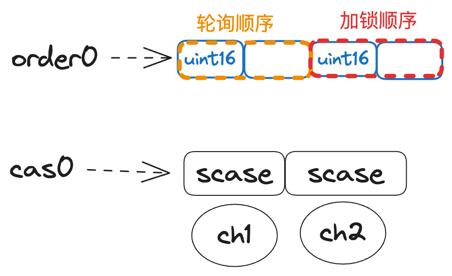

# Table of Contents

- [Table of Contents](#table-of-contents)
- [介绍](#介绍)
- [channel 设计](#channel-设计)
		- [lock](#lock)
		- [buf](#buf)
		- [qcount,dataqsiz](#qcountdataqsiz)
		- [elemsize](#elemsize)
		- [elemtype](#elemtype)
		- [sendx,recvx](#sendxrecvx)
		- [sendq,recvq](#sendqrecvq)
- [使用案例](#使用案例)
	- [介绍](#介绍-1)
	- [发送](#发送)
		- [阻塞](#阻塞)
		- [非阻塞](#非阻塞)
		- [非阻塞并超时控制](#非阻塞并超时控制)
	- [接收](#接收)
		- [阻塞](#阻塞-1)
		- [非阻塞](#非阻塞-1)

---

# 介绍
在正式开始讲解channel之前，首先明白一些channel的知识点

1. 声明和初始化：可以使用内置的`make`函数来创建一个channel。例如，`ch := make(chan int)`会创建一个传递整数类型的channel。

2. 发送和接收操作：使用`<-`操作符进行发送和接收操作。发送操作将数据发送到channel，接收操作从channel接收数据。例如，`ch <- data`将数据发送到channel，`data := <- ch`从channel接收数据。

3. 阻塞和非阻塞：默认情况下，发送和接收操作是阻塞的，意味着在发送或接收数据之前，goroutine会被阻塞。这可以用于实现同步。可以使用`select`语句结合`default`子句来实现非阻塞的发送和接收操作。

4. 单向channel：可以将channel限制为只发送或只接收操作。这可以增加程序的安全性和表达性。例如，`chan<- int`表示只能发送整数的channel，`<-chan int`表示只能接收整数的channel。

5. 关闭channel：可以通过调用`close`函数来关闭一个channel。关闭channel后，接收操作仍然可以接收已经发送的数据，但是不再能发送数据。

# channel 设计
假设我们定义一个缓冲大小为5，类型为 int 的 channel
```
ch := make(chan int,5)
```
`ch`是栈上的一个指针，指向堆上的`hchan`数据结构


### lock
根据CSP模型，channel是用于在不同的并发执行单元（goroutine）之间传递消息的通信机制。
多个 goroutine 可以同时尝试发送或接收数据到/从通道。为了避免竞争条件和数据不一致的问题，要有一把互斥锁用于同步并发访问通道的内部状态。
```golang
lock mutex
```

### buf
对于有缓冲的channel来将，需要一个循环队列(circular queue)用于在channel中存储数据
**循环队列**是一种**环形**数据结构，可以高效地进行数据的入队和出队操作。

通过使用循环队列，buf 字段实现了以下功能：

存储数据：buf 字段指向的数组用于存储通道中的数据元素。当一个 goroutine 发送数据到通道时，数据将被添加到循环队列的末尾；当一个 goroutine 从通道接收数据时，数据将从循环队列的开头被取出。

支持循环操作：由于 buf 字段指向的数组是一个循环队列，因此当队列的末尾达到数组的末尾时，下一个元素将会被放置在数组的开头。这使得循环队列可以循环使用数组空间，而不会浪费内存。


```golang
buf      unsafe.Pointer // points to an array of dataqsiz elements
```

### qcount,dataqsiz
除了存储数据以外，我们还需要知道已经存储了多个元素，以及最多可以存储多少个元素
我们设计 `qcount` 和 `dataqsiz` 字段分别用于记录通道中的数据数量和循环队列的大小

* `qcount`：它表示当前通道中的数据元素数量。每当有一个 goroutine 发送数据到通道或从通道接收数据时，qcount 的值将相应地增加或减少。通过跟踪数据数量，可以在并发操作中确保通道中的数据一致性。

* `dataqsiz`：它表示循环队列的大小，也就是循环队列可以容纳的数据元素数量。该值在创建通道时进行设置。循环队列的大小影响了通道的容量和性能。较大的 dataqsiz 值意味着更多的内存用于存储通道数据，但也提供了更大的容量和更高的吞吐量。

### elemsize
除了容量以外，我们还需要记录每个元素的大小 `elemsize`

* 内存分配：elemsize 字段用于确定为每个元素分配的内存空间大小。当创建通道时，系统会根据 elemsize 的值来分配足够的内存空间来存储每个元素。

* 数据校验：elemsize 字段还用于在通道的发送和接收操作中进行数据校验。在发送数据到通道时，系统会检查要发送的数据的大小是否与 elemsize 字段的值一致，以确保数据的完整性和正确性。同样，在从通道接收数据时，系统也会检查接收到的数据的大小与 elemsize 字段是否匹配，以保证数据的有效性。


### elemtype
保证通道的类型安全和内存管理而设立的。从内存分配的角度来看,编译器和运行时为了确定channel缓冲区的大小和每个元素在缓冲区中的偏移量，设立一个 elemtype 字段表示通道中元素的类型。它是一个指向 `runtime._type` 结构体的指针，用于描述通道中元素的具体类型信息。

* 内存分配：通过 `elemtype` 字段，系统可以在运行时了解通道中元素的类型信息。这对于进行内存分配非常重要，因为系统需要知道每个元素的大小和对齐方式，以便正确地分配和管理内存空间。

* 垃圾回收：`elemtype` 字段还在垃圾回收过程中起着重要的作用。垃圾回收器需要了解通道中元素的类型信息，以便正确地扫描并回收不再使用的对象。通过 `elemtype` 字段，垃圾回收器可以准确地确定通道中存储的对象是否仍然活跃，并相应地回收未使用的内存。

除此以外，`elemtype` 字段还可以帮助编译器和运行时检查发送或接收的值是否与通道的类型匹配，以及在接收时进行类型断言

### sendx,recvx
接下来需要考虑如何在高并发环境下进行读取或写入操作，为保证公平性和高并发情况下，设立 `sendx` 和 `recvx` 字段在 hchan 里面的指示通道缓冲区中的发送和接收索引

* `sendx` 字段：它表示下一个要发送数据的位置（索引）。当一个 goroutine 发送数据到通道时，它将数据放置在 sendx 所指示的位置，并将 sendx 的值递增。这样可以确保每个 goroutine 在通道中发送数据时都能够访问到自己的位置，避免数据的覆盖和冲突。

* `recvx` 字段：它表示下一个要接收数据的位置（索引）。当一个 goroutine 从通道接收数据时，它将从 recx 所指示的位置获取数据，并将 recx 的值递增。这样可以确保每个 goroutine 在通道中接收数据时都能够访问到自己的位置，避免数据的混乱和丢失。

因为 `sendx` 和 `recvx` 都是使用原子操作来更新的，这意味着它们不会被其他的 goroutine 干扰或修改，也不需要加锁来保护它们。
这样就可以提高通道操作的高并发性能，因为不会有锁的开销和竞争。
其次，`sendx` 和 `recvx` 都是按照 FIFO 的顺序来指向缓冲区中的槽位的，这意味着它们会按照发送或接收的顺序来匹配对方。
这样就可以实现通道操作的公平性，因为不会有优先级或随机性的影响。当然，如果通道是无缓冲的，那么 sendx 和 recvx 就没有作用了，因为无缓冲的通道只能同时存储一个元素，所以发送和接收必须同时发生，才能成功

### sendq,recvq
当一个 goroutine 想要对一个通道进行发送或接收操作时，如果通道是空的或满的，或者已经关闭了，那么这个 goroutine 就会被阻塞
我们需要 `recvq` 和 `sendq` 用于存储等待接收和等待发送的 `goroutine` 队列,以便于条件满足的时候唤醒相应的 goroutine
recvq 和 sendq 是存储了一个双向链表`waitq`，该链表每个节点是一个 `sudog` 结构体，它包含了被阻塞的 goroutine 的信息，以及它想要发送或接收的值的地址
下面是 waitq 结构体的定义
```golang
// 双向链表存储头和尾的节点
type waitq struct {
	first *sudog
	last  *sudog
}
```


下面是 `sudog` 结构体的定义
```golang
// sudog 是在等待列表中表示goroutine的对象，用于在channel上发送/接收等操作。
// sudog的存在是因为goroutine与同步对象之间的关系是多对多的。一个g可以在多个等待列表上，所以可能会有多个sudog对应一个goroutine；
// 同时，许多goroutine可能正在等待相同的同步对象，因此可能会有多个sudog对应一个对象。
// sudog是从一个特殊的池中分配的。可以使用acquireSudog和releaseSudog来分配和释放它们
type sudog struct {
    // 指向被阻塞的 g 的指针，它保存了 g 的状态和栈信息
	g *g    

    // 双向链表的指针，它们用于将 sudog 连接到等待队列中的其他 sudog
	next *sudog
	prev *sudog

    // 字段是一个指向数据元素的指针，它可能指向栈上或堆上的内存空间，用于存储想要发送或接收的值。
	elem unsafe.Pointer // data element (may point to stack)

    // 以下字段禁止并发访问。
    // 对于通道，waitlink只由g访问。
    // 对于信号量，所有字段（包括上面的字段）只在持有semaRoot锁时访问。

    // goroutine 获取锁或进入等待状态的时间戳
	acquiretime int64
    // goroutine 释放锁或被唤醒的时间戳
	releasetime int64
    // 记录 sudog 在等待队列中的位置的整数，它用于实现公平的调度策略
	ticket      uint32

	// 表示 g 是否参与了 select 语句的布尔值，它用于决定是否需要使用 CAS 操作来赢得唤醒竞争
    // CAS (CompareAndSwap) CAS操作是一种在多线程编程中实现同步的原子指令，常用在无锁算法中。
    // 它的含义是比较并交换，它的作用是比较一个内存位置的内容和一个给定的值(通常是旧值)，只有当它们相等时，才将该内存位置的内容修改为一个新的给定值，如果不相等说明被其他线程更改了内存位置的内容
    // 这是作为一个单一的原子操作完成的。原子性保证了新值是基于最新的信息计算的；如果该值在此期间被另一个线程更新了，那么写入操作就会失败。
    // 操作的结果必须指示它是否执行了替换；这可以通过一个简单的布尔值响应来做（这种变体通常称为比较并设置），或者通过返回从内存位置读取的值（而不是写入它的值）来做。
	isSelect bool

	// 表示通道操作是否成功的布尔值，它为true时表示 g 被唤醒是因为通道上有值被传递，
	// 为false时表示 g 被唤醒是因为通道被关闭。
	success bool

	// 记录除了等待队列头部之外的其他等待者数量的整数，它被限制为 uint16 类型，以便利用未使用的空间。
	// 这个字段只在等待队列的头部有意义
	waiters uint16

	// 下面这一部分需要结合 https://go.dev/src/runtime/sema.go 来看才明白，这里暂且跳过
	parent   *sudog // semaRoot binary tree
	waitlink *sudog // g.waiting list or semaRoot
	waittail *sudog // semaRoot

	// 与之绑定的channel
	c        *hchan 
}
```

# 使用案例
## 介绍
在正式使用之前，需要补充channel的几个知识点
假设下面我们有下面找个代码
```golang
ch := make(chan int,3)
ch <- 1
ch <- 2
ch <- 3
ch <- 4 // block
```

我们创建了一个容量为**3**的channel，并且向里面发送了**4**个数据
其中当发送第四个数据`ch <- 4`的时候，因为容量已经满了，会发生阻塞
此刻channel就会创建一个`sudog`添加到`sendq` 队列中
下面是`sudog`的大体数据
```golang
type sudog struct {
	g *g	// 绑定阻塞的goroutine
	...
	elem	unsafe.Pointer	// 存储需要发送的值，这里是4
	...
	c	*hchan	// 绑定通道的指针
}
```

直到另一个goroutine从`channel`里面提取数据出来
```golang
tmp := <-ch
```
此时有一个位置空出来了，会唤醒`sendq`队列中的goroutine并移除，
同时将`sudog.elem`的数据发送给 channel后，此刻`sendq`队列为空


## 发送
### 阻塞
以下几种情况会导致发送数据阻塞
* 缓冲区为空，并且`recvq`也为空
* 缓冲区满了，但是`recvq`为空
* channel 为 nil或者关闭的情况 (此时写入会发生`painc`)

```golang
ch <- 10	// wait for free
```

### 非阻塞

如果想以非阻塞的方式发送数据，可以通过`select`语句和`default`子语句来实现
```golang
package main

import (
	"fmt"
	"time"
)

func main() {
	ch1 := make(chan int)
	ch2 := make(chan int)

	// 发送数据到通道
	go func() {
		ch1 <- 1
	}()
	time.Sleep(1*time.Millisecond)

	// 接收数据并打印
	select {
	case data := <-ch1:
		fmt.Println("Received data from ch1:", data)
	default:
		fmt.Println("No data received from ch1")
	}

	// 尝试接收数据，但通道为空
	select {
	case data := <-ch2:
		fmt.Println("Received data from ch2:", data)
	default:
		fmt.Println("No data received from ch2")
	}
}
```

如果可以发送数据，则会执行`case ch <- 10`分支
如果不可以发送数据，则会执行`default`分支以进行其他操作


### 非阻塞并超时控制
在基于非阻塞的情况，添加`context.Context`来进行超时控制
```golang
package main

import (
	"context"
	"fmt"
	"time"
)

func main() {
	ctx := context.Background()
	ctx, cancel := context.WithTimeout(ctx, 1*time.Second)
	defer cancel()

	ch := make(chan int)

	// 启动一个goroutine发送数据到通道
	go func() {
		time.Sleep(1 * time.Second)
		ch <- 1
	}()

	// 非阻塞的接收操作，带超时
	select {
	case data := <-ch:
		fmt.Println("Received data:", data)
	case <-ctx.Done():
		fmt.Println("Timeout occurred")
	}
}
```

## 接收
先来看看接收有多种写法

```golang
// 将结果丢弃
<-ch
// 将结果赋值给变量
v := <-ch
// comma ok风格的写法，ok为false时表示ch已关闭
// 如果关闭的时候缓冲区还有数据，则还可以继续接收数据直到为空
v,ok := <-ch
```

可以用下面代码来验证channel关闭的情况，缓冲区有无数据对 `value` 和 `ok` 各自的影响
```golang
package main

import "fmt"

func main() {
	ch := make(chan int, 3)

	ch <- 1
	ch <- 2
	ch <- 3

	close(ch)

	for {
		value, ok := <-ch
		if ok {
			fmt.Println("Received value:", value)
		} else {
			fmt.Printf("Channel closed,and recv value is %v",value)
			break
		}
	}
}
```

运行之后的结果为
```
Received value: 1
Received value: 2
Received value: 3
Channel closed,and recv value is 0
```

### 阻塞
以下几种情况会导致接受数据阻塞
* channel 为空，并且`sendq`队列为空
* channel 为空，并且没有缓冲区

```golang
10 -> ch
```

### 非阻塞
想要非阻塞，也可以使用 `select` 和 `default` 写法
```golang
package main

import (
	"fmt"
	"time"
)

func main() {
	ch := make(chan int)

	go func() {
		time.Sleep(2 * time.Second)
		ch <- 123
	}()

	select {
	case value := <-ch:
		fmt.Println("Received value from ch:", value)
	default:
		fmt.Println("No value available from ch")
	}
}
```

### 非阻塞并超时控制

```golang
package main

import (
	"context"
	"fmt"
	"time"
)

func main() {
	ch := make(chan int)

	go func() {
		time.Sleep(2 * time.Millisecond)
		ch <- 123
	}()

	ctx, cancel := context.WithTimeout(context.Background(), 1*time.Millisecond)
	defer cancel()

	select {
	case value := <-ch:
		fmt.Println("Received value from ch:", value)
	case <-ctx.Done():
		fmt.Println("Timeout occurred")
	}
}
```

## 多路选择
当使用select 语句在多个通道操作之间进行选择，比如下面这个例子

```golang
var a,b int
b = 10
select {
	case a=<-ch1:	// 执行接收操作
		fmt.Println(a)
	case ch2 <- b:	// 执行发送操作
	default:		// 当没有任何通道操作准备就绪时执行的逻辑，如果注释掉这一行，则必须要满足任意条件后select 才能继续
}
```

多路select会被编译器转换为[runtime.selectgo](https://github.com/golang/go/blob/8c92897e15d15fbc664cd5a05132ce800cf4017f/src/runtime/select.go#L121)函数调用
```golang
// selectgo implements the select statement.
//
// cas0 points to an array of type [ncases]scase, and order0 points to
// an array of type [2*ncases]uint16 where ncases must be <= 65536.
// Both reside on the goroutine's stack (regardless of any escaping in
// selectgo).
//
// For race detector builds, pc0 points to an array of type
// [ncases]uintptr (also on the stack); for other builds, it's set to
// nil.
//
// selectgo returns the index of the chosen scase, which matches the
// ordinal position of its respective select{recv,send,default} call.
// Also, if the chosen scase was a receive operation, it reports whether
// a value was received.
func selectgo(cas0 *scase, order0 *uint16, pc0 *uintptr, nsends, nrecvs int, block bool) (int, bool)
```

* cae0: 指向一个`ncases`大小的`scase`数组，里面装的是select中所有的`case`分支
数组里面的case分支的顺序是由select语句中的case分支的顺序决定的，它们是一一对应的

cas0数组里面的case分支的顺序并不影响select语句的执行结果，因为select语句会随机打乱cas0数组的顺序，然后遍历cas0数组，检查每个case分支是否可以执行。这样做是为了保证select语句在多个case分支都可以执行时，能够随机选择一个执行，而不是总是选择第一个或最后一个。

cas0数组里面的case分支的顺序只在有default case时有一些影响，因为default case总是放在cas0数组的最后一个位置。这意味着如果没有任何其他case分支可以执行，那么select语句会直接执行default case，而不会调用runtime.block函数来阻塞当前的goroutine。

* order0: 指向一个uint16类型的数组，大小是ncases的两倍即等于case分支数量的两倍
里面存放了每个`case`分支的下标，比如说 [0, 1, 2, 0, 1, 2]
该数组被分为大小相同的两个数组[`polloder`和`lockorder`](https://github.com/golang/go/blob/8c92897e15d15fbc664cd5a05132ce800cf4017f/src/runtime/select.go#L133C7-L133C7)
`polloder`用来对所有的channel的轮询进行乱序
`lockorder`用来对所有的channel的加锁操作进行排序
乱序执行能**保障公平性**
有序加锁**避免死锁**

* pc0: 是一个指向[ncases]uintptr类型数组的指针，它表示case分支的程序计数器（PC）。这个参数只在race detector构建时使用，其他情况下设为nil。

* nsends和nrecvs是两个整数，分别表示select语句中执行`send`和`recv`操作的分支分别有多少个，二者总和不能超过65536(即uint16的大小)

* block: 表示select语句是否需要阻塞等待通信操作,对应代码里面就是有`default`分支的不会阻塞 

整个传入数据内存布局如下:


接下来再看下[`scase`结构体](https://github.com/golang/go/blob/8c92897e15d15fbc664cd5a05132ce800cf4017f/src/runtime/select.go#L19)
```golang
// Select case descriptor.
type scase struct {
	c    *hchan         // chan
	elem unsafe.Pointer // data element
}
```

* `c`: 指向case分支的所对应的channel的指针
* `elem`: 它表示`case`分支中涉及到的数据元素。如果`case`分支是一个发送操作，那么`elem`表示要发送到通道的值；如果`case`分支是一个接收操作，那么`elem`表示从通道接收到的值。


对于返回值(int, bool)分别代表着所对应的`case`分支和当执行`v,ok:=<-ch`的时候`ok`标识

### select 过程
> 建议去看 https://www.bilibili.com/video/av246038798?p=29 有更加直观的动画过程
接下来我们根据`selectgo`的[源代码](https://github.com/golang/go/blob/8c92897e15d15fbc664cd5a05132ce800cf4017f/src/runtime/select.go#L121)撸一遍
这里简单的阐述一下

1. 将接收的`cas0`和`order0`转化成65536个scase数组和 2*65536个unit16数组
```golang
	cas1 := (*[1 << 16]scase)(unsafe.Pointer(cas0))
	order1 := (*[1 << 17]uint16)(unsafe.Pointer(order0))
```

2. 计算出有channel读写操作的case分支的数量，并从`cas1`和`order1`中获取这些分支

```golang
	ncases := nsends + nrecvs
	scases := cas1[:ncases:ncases]
	pollorder := order1[:ncases:ncases]
	lockorder := order1[ncases:][:ncases:ncases]
```

* `scases`: 表示select语句中的各个case分支，包括涉及到的通道和数据元素,该操作将切片的长度和容量都为`ncases`,这样做是为了只保留有channel操作的`case`分支
* `pollorder`: 将order1数组的前`ncases`切片作为乱序执行的操作空间
* `lockorder`: 将`order1`数组的后`ncases`切片作为有序加锁的空间


3. 遍历`scases`数组来对`case`执行顺序进行洗牌
```golang
	// generate permuted order
	norder := 0
	for i := range scases {
		cas := &scases[i]

		// Omit cases without channels from the poll and lock orders.
		if cas.c == nil {
			cas.elem = nil // allow GC
			continue
		}

		j := fastrandn(uint32(norder + 1))
		pollorder[norder] = pollorder[j]
		pollorder[j] = uint16(i)
		norder++
	}
	pollorder = pollorder[:norder]
	lockorder = lockorder[:norder]
```
在洗牌的过程中，对于没有`channel`实际地址的case分支**不参与**乱序执行+有序加锁的过程
并且还将其elem字段设为nil以方便GC

4. 使用堆排序，按照`scases`数组对应的**通道地址从小到大排序**后放入到`lockorder`中
保证在**顺序加锁**，**逆序解锁**,从而避免死锁
```golang
	// sort the cases by Hchan address to get the locking order.
	// simple heap sort, to guarantee n log n time and constant stack footprint.
	for i := range lockorder {
		...
	}
```


5. 将`lockorder`中所有的`scase`进行有序加锁
```golang
	// lock all the channels involved in the select
	sellock(scases, lockorder)
```


6. 遍历`pollorder`数组，已经准备好的通道操作，则会通过跳转到相应的标签来执行对应的操作，并且在操作完成之后根据情况（比如channel 已经关闭)是否还需要继续遍历还是退出

如果没有找到准备好的通道操作，并且不允许阻塞，则会在最后的判断中解锁并返回

```golang
	// pass 1 - look for something already waiting
	for _, casei := range pollorder {
	}
```

7. 如果之前的步骤没有可操作步骤并且允许阻塞，则将遍历所有的`lockorder`数组
获取一个空闲的`sudog`结构体，并将该`sg`放入到对应的channel的`sendq`或者`recvq`等待数组中

```golang
	// pass 2 - enqueue on all chans
	for _, casei := range lockorder {
	}
```

8. 然后将自身goroutine进入休眠，并且释放掉自身的锁(channel的锁是锁在某一个goroutine上面的)
```golang
	// wait for someone to wake us up
	gp.param = nil
	// Signal to anyone trying to shrink our stack that we're about
	// to park on a channel. The window between when this G's status
	// changes and when we set gp.activeStackChans is not safe for
	// stack shrinking.
	// 将当前goroutine挂起，并传递selparkcommit函数、waitReasonSelect原因、traceBlockSelect事件和1标志
	gopark(selparkcommit, nil, waitReasonSelect, traceBlockSelect, 1)
```


9. 唤醒成功后，先对`lockorder`进行加锁
然后遍历`lockorder`找到被唤醒的`case`分支，并且将自身从其他的`channel`等待队列中移除自身
```golang
	sellock(scases, lockorder)
	// pass 3 - dequeue from unsuccessful chans
	// otherwise they stack up on quiet channels
	// record the successful case, if any.
	// We singly-linked up the SudoGs in lock order.
	for _, casei := range lockorder {
		if sg == sglist {
		}
	}
```

10. 解锁所有的`lockorder`然后退出


# 参考
---

[How does select work when multiple channels are involved?](https://stackoverflow.com/questions/47645808/how-does-select-work-when-multiple-channels-are-involved)